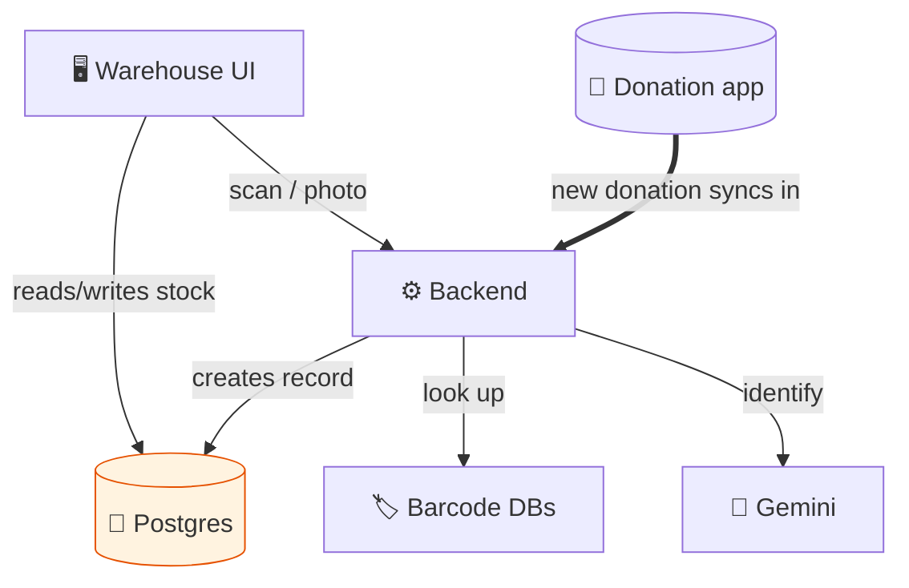

# How the Inventory System Is Built — Quick Guide

_The pieces, and how they connect. (Full detail? See
[the detailed version](architecture-ims.md).)_

---

## The pieces

**Ours:**

- 🖥️ **Warehouse UI** — where staff scan, catalog, and manage stock (sign-in required)
- ⚙️ **Backend** — barcode lookups, photo-to-product AI, the donation sync
- 🐘 **Postgres database** — the real inventory store (donors, donations, products, batches, shelters)

**Google Cloud / outside:**

- 🔐 **Sign-in** (Firebase Auth) · 🤖 **Gemini AI** (photo scan + barcode fallback) · 🏷️ **Barcode databases** (free)

> **Inventory lives in Postgres, not Firestore** — the big difference from the donation app.

---

## How they connect

**The thick arrow:** donations from the public app flow in automatically, so the warehouse
knows what's coming.

---

## What happens, in one breath

Staff sign in → **scan a barcode or snap a photo** → backend identifies the product (barcode
DBs, or AI) → item saved to Postgres as **in stock** → staff group items into a **batch** for
a shelter → **finalize → ship → deliver**. Donations from the app **sync in on their own**.

---

## The backend is just 3 small programs

| Program | Runs when |
| --- | --- |
| Barcode lookup | Staff scan a barcode |
| Photo → product | Staff take a product photo |
| Donation sync | A donation is created in the donation app |

---

## Three apps, one project

The inventory system shares the `beauty-forward` Firebase project with the **donation app**
(which feeds it) and the **data dashboard** (which reads its Postgres to report).
_(Whole picture → [System Overview](https://github.com/Beauty-Forward/donation-delivery-app/blob/main/docs/system-overview.md).)_
