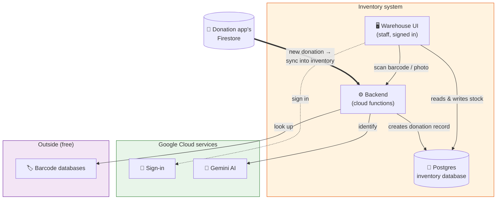

# Architecture — Inventory System (IMS)

> **Who this is for:** Anyone who needs to understand how the inventory system is put
> together — the pieces, how they connect, and where things live — without reading the
> code. Non-technical readers can stop at _[Part of a bigger system](#part-of-a-bigger-system)_;
> a technical successor should keep going into the appendix.
>
> **Companion docs:** the **[Inventory Lifecycle & State Machine](inventory-lifecycle-state-machine.md)**
> (what an item _does_ from arrival to shipment) and **[Accounts & Services](accounts-and-services.md)**
> (how to sign in to each piece). The whole-picture map of all three apps is the
> **[System Overview](https://github.com/Beauty-Forward/donation-delivery-app/blob/main/docs/system-overview.md)**.

---

## What this app is

The **warehouse's tool**. Staff sign in to log the beauty products that arrive, track
what's in stock, group items into outgoing **batches**, and ship those batches to
**shelters**. Unlike the public donation app, **this one requires a login** — it's for the
team, not donors.

---

## The moving parts

| Piece | Who runs it | What it does |
| --- | --- | --- |
| **The website** (warehouse UI) | Us (on Firebase) | What staff use to scan, catalog, and manage stock — after signing in |
| **The backend** (cloud functions) | Us (on Firebase) | Barcode lookups, photo-to-product AI, and the donation sync |
| **The database** (Postgres) | Google Cloud (via Data Connect) | The real inventory store — donors, donations, products, batches, shelters |
| **Sign-in** (Firebase Auth) | Google Firebase | Only signed-in staff can use the app |
| **Gemini AI** (Vertex AI) | Google Cloud | Reads a product photo and identifies a barcode when databases can't |
| **Barcode databases** | Outside (free) | Look up a scanned barcode → product name/brand |

> **The inventory lives in Postgres, not Firestore.** That's the big difference from the
> donation app. The donation app's Firestore is used here only as the _source_ of the
> donation sync (below).

---

## How it fits together

**The thick arrow is the cross-app link:** whenever the donation app records a donation,
that automatically flows into the inventory system so the warehouse expects it.

---

## The flow in a paragraph

A staff member signs in and works through the warehouse UI. To catalog an item they
**scan its barcode** or **take a photo** — the backend looks the barcode up across free
databases (and asks the AI if those miss), or the AI reads the photo and fills in the
product's details. The item is saved to the **Postgres** database as **in stock**. Later,
staff group in-stock items into a **batch** for a shelter, **finalize** it, and mark it
**shipped** and **delivered** — each step moves the items and the batch along their
lifecycle (see the **[Inventory Lifecycle](inventory-lifecycle-state-machine.md)** doc).
Separately, donations arranged in the public app **sync in automatically**, so the
warehouse already knows what's coming.

---

## Where the data lives

The inventory database (Postgres) has five main kinds of record:

| Record | What it is |
| --- | --- |
| **Donor** | A person who donated (name, contact, city) |
| **Donation** | A package of products received at the warehouse (from the app, or a walk-in) |
| **Product** | One item in inventory — the heart of the system; its **status** drives everything |
| **Batch** | An outgoing shipment to a shelter |
| **Shelter** | A distribution partner that receives batches |

A **Product** belongs to a **Donation**; when it's added to a **Batch**, it's linked there
too. Product and Batch each move through a set lifecycle — that's the state-machine doc.

---

## The backend, function by function

The backend is **three** small programs ("cloud functions"):

| Function | Runs when… | What it does |
| --- | --- | --- |
| `lookupProductByBarcode` | Staff scan a barcode | Looks the code up: UPCitemdb → Open Beauty/Food Facts → Gemini AI as a last resort |
| `extractProductFromImage` | Staff take a product photo | Uses Gemini to read the photo and fill in name, brand, type, etc. |
| `onDonationRequestWrite` | A donation is created/updated in the donation app | Mirrors it into the inventory database as a Donation record (so nothing is re-keyed) |

---

## How we keep it safe

- **Sign-in required.** Every action needs a signed-in Firebase account — there's no public
  access. All database operations are gated on a valid login.
- **The donation sync runs server-side.** `onDonationRequestWrite` runs with trusted
  server credentials and is **idempotent** — the same donation firing twice updates the one
  record instead of creating duplicates.
- **The dashboard can't change inventory.** The data dashboard reads this Postgres database
  through a **read-only** account — it can report on inventory but never alter it.

---

## Configuration & environments

- **Website settings** live in the frontend's environment files (which Firebase project,
  etc.) — public by design.
- **Backend settings** are minimal: an optional paid barcode-lookup key. The AI and the
  database authenticate as the Google Cloud project itself, with no key to manage.
- Full inventory of accounts and keys is in **[Accounts & Services](accounts-and-services.md)**.

---

## Part of a bigger system

The inventory system is the **second of three** Beauty Forward apps, all sharing one Google
Firebase project:

1. **Donation app** — the public site where donations start. Feeds this system via the sync.
2. **This inventory system** — the warehouse's stock, batches, and shelter shipments.
3. **Data dashboard** — reads this system's Postgres database to report on impact.

The whole-picture map is the
**[System Overview](https://github.com/Beauty-Forward/donation-delivery-app/blob/main/docs/system-overview.md)**.

---

## Appendix — for the technical successor

**Stack.** Angular 21 (standalone, SCSS) frontend; Firebase Cloud Functions v2 (codebase
`ims`, region `us-central1`); **Firebase Data Connect → Postgres** (Cloud SQL instance
`beauty-forward-fdc`, database `fdcdb`, Data Connect service `beauty-forward-service`,
connector `bf-ims`). Frontend on App Hosting backend `inventory-management-system`.

**Frontend shape.** Features under `src/app/features/`: `donations`, `inventory`, `batches`,
`shelters`, `dashboard`, `login`. Barcode scanning via `@zxing/browser` + `@zxing/library`;
camera/photo capture components under `src/app/shared/components/` (`camera-scanner`,
`photo-capture`). Auth in `core/services/auth.service.ts` + `core/guards/auth.guard.ts`.
Data Connect generated SDK lives in `core/dataconnect/` (regenerated from the schema;
`npm run reset-dc-sdk` restores it).

**Data model** (`dataconnect/schema/schema.gql`): `Donor`, `Donation`, `Shelter`, `Batch`,
`Product`. Enums `ProductStatus` (IN_STOCK/ALLOCATED/SHIPPED/EXPIRED/DISCARDED) and
`BatchStatus` (DRAFT/FINALIZED/SHIPPED/DELIVERED). Lifecycle transitions are the connector
mutations in `dataconnect/connector/mutations.gql` (`AllocateProductToBatch`,
`FinalizeBatch`, `ShipBatch`, `DeliverBatch`, `MarkProductExpired/Discarded`,
`ReturnBatchProductsToStock`, …), all `@auth(level: USER)`. Product `type` is an app-layer
enum (`product-types.ts`), not a DB enum; `details` is flexible JSON.

**Backend** (`functions/src/index.ts`, codebase `ims`): `lookupProductByBarcode` (onCall;
cascade UPCitemdb → Open Beauty/Food Facts → Gemini text, `gemini-2.5-flash` via Vertex
AI), `extractProductFromImage` (onCall; Gemini vision), `onDonationRequestWrite`
(onDocumentWritten `donation_requests/{docId}`; mirrors delivery-app donations into the
Postgres `Donation` table, idempotent by `donationRequestId`, coerces `createdAt`
Timestamp-or-ISO via `toIsoDay` — see donation-delivery-app#91).

**Firestore vs Postgres.** IMS's own `firestore.rules` is emulator-only; production
Firestore is the donation app's and that repo's rules are authoritative. IMS writes
Firestore only through the server-side sync trigger. The system of record for inventory is
**Postgres**.

**Local dev.** `npm run start-with-seed` (emulators → seed → serve), or `npm run emulators`
(auth + dataconnect + firestore + functions) then `npm run seed`. Emulator Postgres is
in-memory — re-seed after a restart.
