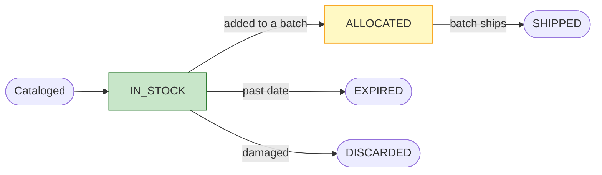
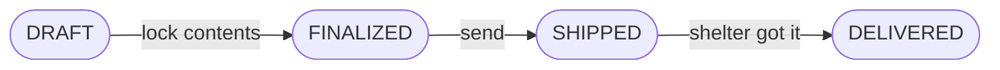

# Inventory Lifecycle — Quick Guide

_Two things move through the warehouse — **Products** and **Batches** — each with a
**status**. (Full detail? See [the detailed version](inventory-lifecycle-state-machine.md).)_

---

## A product's journey

| Status | Means |
| --- | --- |
| 🟢 `IN_STOCK` | Available |
| 🟡 `ALLOCATED` | Reserved in a batch, not shipped yet |
| ✅ `SHIPPED` | Left the warehouse |
| `EXPIRED` / `DISCARDED` | Removed on purpose |

---

## A batch's journey

`DRAFT` → `FINALIZED` → `SHIPPED` → `DELIVERED`. Shipping a batch flips its products to
`SHIPPED` too.

---

## How stock gets in

1. A donation **syncs in** from the app (or a **walk-in** is logged).
2. Staff **scan or photograph** each item → it becomes a **Product**, `IN_STOCK`.

> The sync records the _donation_, **not the items** — someone still catalogs the products.

---

## Stuck?

- **Product stuck `ALLOCATED`** → it's in a batch that hasn't shipped. Ship the batch, or take it out.
- **Donation shows no products** → normal; catalog them.
- **Batch `SHIPPED` but not arrived** → the app doesn't track couriers; check with the shelter, then mark `DELIVERED`.
