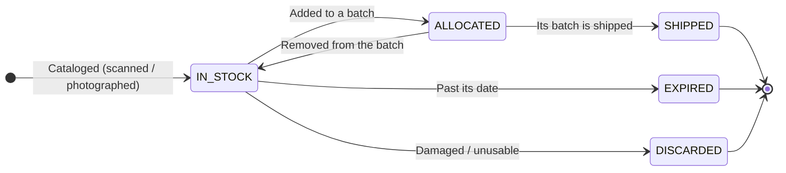
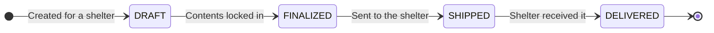

# Inventory Lifecycle & State Machine

> **Who this is for:** Anyone on the Beauty Forward team who needs to understand where an
> item or a shipment is in its journey through the warehouse — and what each status means.
> No engineering background assumed.
>
> **Companion docs:** **[Architecture — IMS](architecture-ims.md)** (how the app is built)
> and the donation app's
> **[Donation Lifecycle](https://github.com/Beauty-Forward/donation-delivery-app/blob/main/docs/donation-lifecycle-state-machine.md)**
> (what happens _before_ items reach the warehouse).

---

## The one idea to hold onto

Two things move through the warehouse, and each has a **status** — a one-word label for
where it is:

- A **Product** — a single item of stock.
- A **Batch** — an outgoing shipment of products to a shelter.

Follow the status and you always know what's happening. The app changes these statuses as
staff do their work; you rarely set one by hand.

---

## How a donation becomes stock

Before an item has a lifecycle, it has to get into the system:

1. A **donation arrives** — either it **syncs in automatically** from the public donation
   app, or a staff member logs a **walk-in**.
2. Staff **catalog the individual products** in that donation by scanning each barcode or
   taking a photo. Each cataloged item becomes a **Product**, starting life **in stock**.

> **Important:** the automatic sync creates the _donation_ record (so the warehouse knows a
> package is coming), but **it does not create the products** — a person still catalogs the
> actual items. A donation with no products yet just means nobody's cataloged it.

---

## A Product's journey

| Product status | What it means | Normal? |
| --- | --- | --- |
| `IN_STOCK` | Cataloged and available to be put in a batch | ✅ The resting state for available stock |
| `ALLOCATED` | Reserved — it's been added to a batch that hasn't shipped yet | ✅ Waiting for its batch to go out |
| `SHIPPED` | Left the warehouse as part of a shipped batch | ✅ Finished here |
| `EXPIRED` | Marked past its expiration date | ✅ Removed from usable stock on purpose |
| `DISCARDED` | Marked damaged or unusable | ✅ Removed on purpose |

> **Delivery is tracked on the batch, not the product.** A product's journey ends at
> `SHIPPED`; whether the shelter received it is the _batch's_ `DELIVERED` status (below).

---

## A Batch's journey

| Batch status | What it means | Normal? |
| --- | --- | --- |
| `DRAFT` | Being built — staff are adding products to it | ✅ Work in progress |
| `FINALIZED` | Contents locked in, ready to send | ✅ Ready to ship |
| `SHIPPED` | On its way to the shelter (its products flip to `SHIPPED` too) | ✅ In transit |
| `DELIVERED` | The shelter received it | ✅ The finish line |

**The two lifecycles are linked:** adding a product to a batch makes it `ALLOCATED`;
shipping the batch makes those products `SHIPPED`. If you remove a product from a batch (or
return a whole batch to stock), those products go back to `IN_STOCK`.

---

## Troubleshooting: "this looks stuck"

### A product sits in `ALLOCATED` for a long time

It's in a **batch that hasn't shipped**. Find the batch it's in — it's probably still
`DRAFT` or `FINALIZED`. Nothing is wrong; the batch just hasn't gone out. Ship the batch (or
remove the product from it to free it back to `IN_STOCK`).

### A donation synced in but shows no products

Expected — the sync records the _donation_, not its items. Someone needs to **catalog the
products** (scan/photo). Until then it correctly shows zero products.

### A batch is `SHIPPED` but the shelter says it never arrived

The app only knows what staff tell it. `SHIPPED` means someone marked it sent; it doesn't
track the courier. Follow up with the shelter directly, then mark it `DELIVERED` once
confirmed.

### Stock counts look too high

Check for items that should be `EXPIRED` or `DISCARDED` but are still `IN_STOCK` — those
still count as available until someone marks them. Expiring/discarding is a manual step.

---

## Where to look

| Question | Go to |
| --- | --- |
| What's in stock / a product's status | The **inventory** section of the app |
| A batch's status and contents | The **batches** section of the app |
| Which shelter a batch is going to | The **shelters** section |
| The raw data (technical) | **Postgres** via Data Connect (Firebase console) |

---

## For the technical successor

- **Statuses** are the `ProductStatus` and `BatchStatus` enums in
  `dataconnect/schema/schema.gql`. Note `ProductStatus` has **no `DELIVERED`** — a product
  ends at `SHIPPED`; delivery is a batch-level status.
- **Transitions** are the connector mutations in `dataconnect/connector/mutations.gql`:
  `AllocateProductToBatch` (→ ALLOCATED), `UnallocateProduct` / `ReturnBatchProductsToStock`
  (→ IN_STOCK), `MarkBatchProductsShipped` (→ SHIPPED), `MarkProductExpired` /
  `MarkProductDiscarded`; and for batches `CreateBatch` (DRAFT), `FinalizeBatch`,
  `ShipBatch`, `DeliverBatch`. All are `@auth(level: USER)`.
- **Donation `logisticsStatus`** is a separate field that _mirrors_ the delivery app's
  donation status (or `walk_in` for walk-ins). It's stored as a string, not an enum, so new
  delivery-app statuses flow through without an IMS schema change. It's synced by
  `onDonationRequestWrite`, not driven by warehouse actions.
- **Getting from donation → products** is a manual cataloging step in the UI (barcode/photo);
  the sync trigger never creates `Product` rows.
