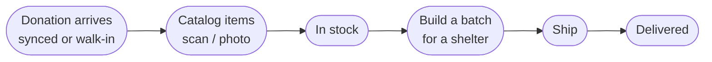

# Inventory System — Quick Guide (for staff)

_The daily jobs. (Full detail? See [the full guide](user-guide-internal.md).)_

---

---

## 5 jobs

1. **Receive a donation** — appears automatically from the app, or log a walk-in.
2. **Catalog products** — 📷 scan a barcode, 📸 photo (AI reads it), or ✍️ type it in. → now **in stock**.
3. **Manage stock** — find items; mark **expired** or **discarded** (both manual).
4. **Build a batch** — pick a shelter, add in-stock items (they become **allocated**), **finalize**.
5. **Ship & deliver** — **ship** it (items flip to shipped), then **mark delivered** when the shelter confirms.

---

## Quick fixes

- **Donation but no products?** → catalog the items; the sync only records the package.
- **Item won't add to a batch?** → it's allocated to another batch; remove it there first.
- **Barcode found nothing?** → try a photo, or enter by hand.
- **Can't sign in?** → account issue → your technical contact.

---

_Sign-in needed — staff only. Whole picture →
[System Overview](https://github.com/Beauty-Forward/donation-delivery-app/blob/main/docs/system-overview.md)._
